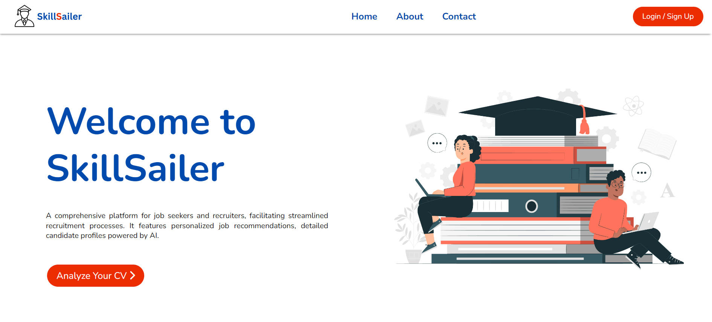
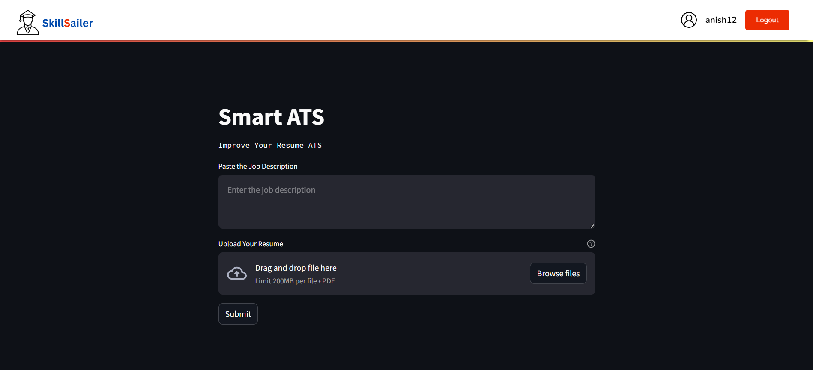

**Presented in HackFest 2024 / TEAM BINARY BOSSES ©**

**_Problem Statement :_**
In today's dynamic job market, individuals and employers face challenges in aligning skills with opportunities. Existing platforms often lack the depth to accurately assess candidates' true potential or match them with suitable roles. Job seekers struggle to find positions that utilize their full skill set, while employers encounter difficulty identifying the best-fit candidates. This gap leads to inefficiencies in hiring and career advancement. There is a critical need for a comprehensive solution that utilizes the power of Artificial Intelligence to bridge this gap, empowering both job seekers and employers to make informed decisions and achieve successful outcomes in their respective endeavors.

**Team Members (Team Binary Bosses):**\
Aniket Banerjee (Leader)\
Ankit Gandhi\
Purujit Ghosh\
Anish Das\
Md Nazmus Sadat

**Objective**

The objective of the above solution is to revolutionize the recruitment process by leveraging the power of artificial intelligence (AI) to provide personalized job recommendations and accurately assess the true potential of each candidate. By analyzing candidate data, including resumes, skills assessments, and performance evaluations, the solution aims to match candidates with suitable job openings based on their skills, experiences, and preferences. Additionally, it seeks to create comprehensive profiles for each candidate to facilitate better decision-making by recruiters and hiring managers. The solution aims to streamline the recruitment process, improve candidate satisfaction, and ultimately contribute to organizational success by ensuring the right talent is matched with the right opportunities.

**Our Solution**

**SkillSailer**

A website that serves as a comprehensive platform for job seekers and recruiters, facilitating streamlined recruitment processes. It features personalized job recommendations, detailed candidate profiles powered by AI. With a user-friendly interface and emphasis on data privacy, the website optimizes the recruitment experience for the candidates.

**Approach**
**Data Collection:**

1. Resume Upload: Users upload their resumes through the web application. The resumes can be in various formats such as PDF, DOC, or DOCX.
2. Keyword Extraction: The uploaded resumes are processed to extract text content. Using libraries like Py2pdf, relevant keywords and skills are identified from the text.

**Data Processing:**

1. Candidate Assessment: Extracted keywords and skills are sent to Gemini AI via API calls for candidate assessment. Gemini AI analyzes the skills and provides an assessment report.
2. Job Matching: The system compares the extracted skills with job descriptions given as input

**Data Display:**

1. Assessment Report: The results from Gemini AI, including a detailed candidate assessment, are displayed to the user through the web interface.
2. Job Recommendations: The matched job opportunities are presented to the user, highlighting the most relevant positions based on their skills and experience.

**Technologies Used**

React Js\
Python\
streamlit\
Firebase\
Gemini API

**Demo**
1. Open a terminal or command prompt.
2. Navigate to the `skillsailer` folder where your React project is located:
   ```bash
   cd skillsailer
3. Install the necessary dependencies:
   ```bash
   npm install
4. Start the React Application
   ```bash
   npm start
5. Now for backend Open a new terminal or PowerShell window. Navigate to the backend folder.
   ```bash
   cd backend
6. Ensure you have all required Python packages installed. You can use a virtual environment or install them directly:
   ```bash
   pip install -r requirements.txt
7. Run the backend streamlit app:
   ```bash
   streamlit run app.py
8. Now you can Create a new account if you do not have any account or just log in. 
9. Navigate to Analyze your CV Button.
10. Enter the job Description and upload the CV (It Should be in PDF format).
11. Click on Submit button.Provide the job description for the role you are targeting. Our platform will extract the required information from your CV. The extracted information and the job description you have entered will be sent to the Gemini API.

12. The Gemini API will return a score indicating how well your CV matches the job description.You will receive suggestions on how to enhance your CV based on the matching analysis. You will also Get recommendations for alternative job roles that might suit your skills and experience.

***Demo Screenshots :***

Here are some screenshots demonstrating the functionality of the SkillSailer platform:

1. **Homepage**:
   

2. **Login Page**:
   

3. **Resume Upload**:
   

4. **Analysis Results**:
   